# Introduction

This repo will show and provide an example of how to use ECM to run workflows to test orchestration adapters.

## Steps

### Authenticating to the system

When executing requests to the system you need an access token. To get an access token you need 4 bits of information:
1. The hostname of the system
2. the SO user username
3. the SO user password
4. the authn proxy client secret

1-3 are straight forward to get, 4 is a bit more involved as it will different for every system.
You need to get a particular bit of data from a secret and decode it, luckily this can all be done in one command:

````
kubectl -n <namespace> get secret eric-bss-bam-authn-proxy-client-secret -o jsonpath='{.data.authnproxyclientsecret}' | base64 --decode
````

This commands gets the `authnproxyclientsecret` data value from the `eric-bss-bam-authn-proxy-client-secret` and decodes it.
This value then needs to be used in all commands to set the `ACCESS_TOKEN` environment variable.

You could set it as an environment variable and reference that in the `ACCESS_TOKEN` command

````
CLIENT_SECRET=$(kubectl -n bam-scrumbledores-nova get secret eric-bss-bam-authn-proxy-client-secret -o jsonpath='{.data.authnproxyclientsecret}' | base64 --decode)

ACCESS_TOKEN=$(curl -k --socks5-hostname localhost:5005 --location https://eric-sec-access-mgmt.supernova-haber003.ews.gic.ericsson.se/auth/realms/master/protocol/openid-connect/token -H 'Content-Type: application/x-www-form-urlencoded' 
--data-urlencode 'client_id=authn-proxy' --data-urlencode 'username=so-user' --data-urlencode 'password=Ericsson123!' --data-urlencode "client_secret=$CLIENT_SECRET" --data-urlencode 'grant_type=password' | jq -r '.access_token')
````

**Be careful with single and double quotes! Environmental variables are not interpolated in single quotes!!!**

### Adding Orchestration artifacts

To add artifacts please select the below link:

* [ECM_SOL005-Adapter Artifacts](eric-esoa-ecmsol005-artifacts/ecmsol005-adapter-artifacts.md)
* [Playbook Service Artifacts](eric-esoa-playbook-artifacts/playbook-service-artifacts.md)
* [Domain Orchestrator Artifacts](domain-orchestrator-artifacts/domain-adapter-artifacts.md)

Note: In this repository if you perform a "mvn clean install" it will create the csar packages.


### Setting Up DNR

DNR is used to convert tosca to sid and transcribe our csar service template into ECM.

1. Onboard  tosca to sid to DNR. The artifact can be found here: https://arm.seli.gic.ericsson.se/artifactory/proj-service-orchestrator-release-local/com/ericsson/oss/orchestration/so/eric-bos-dr-tosca-sid/
2. Unzip the zip file. you will have another zip file for the feature pack for DNR and a rest-service-resources folder. 
3. Click the top right plus inside a circle icon and drag the zip file from previous step into the UI box. In this case take note for the examples the name as this will be used later for sending RESTrequests
4. 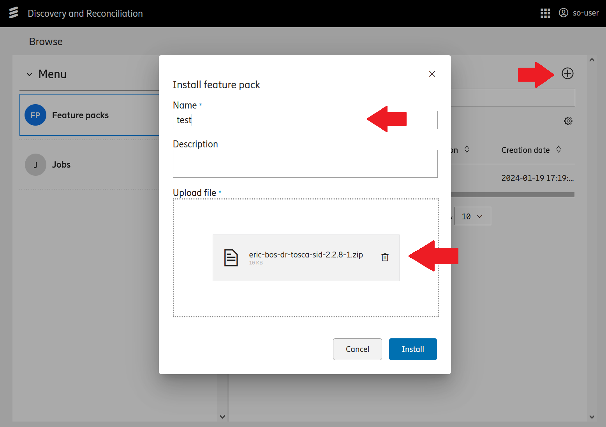  
5. In the rest-service-resources are 2 yaml files. These need to be added separately.
6. Add the following files as per example
   ````
   [Login]
   ACCESS_TOKEN=$(curl -k --socks5-hostname localhost:5005 --location https://eric-sec-access-mgmt.supernova-haber003.ews.gic.ericsson.se/auth/realms/master/protocol/openid-connect/token -H 'Content-Type: application/x-www-form-urlencoded' --data-urlencode 'client_id=authn-proxy' --data-urlencode 'username=so-user' --data-urlencode 'password=Ericsson123!' --data-urlencode 'client_secret=ir8hzyEM5tanYOVTnWhSHIfd6MizYMwSx' --data-urlencode 'grant_type=password' | jq -r '.access_token')
        
   [adding ecm_resource.yml]
   curl -k --insecure --socks5-hostname localhost:5005 POST --location 'https://dr.supernova-haber003.ews.gic.ericsson.se/rest-service/v1/resource-configurations' \
   -H "Authorization: Bearer ${ACCESS_TOKEN}" \
   -H 'content-type: multipart/form-data' \
   -F file=@/c/Users/egergle/rest/esoa/templates/dnr/rest-service-resources/ecm_resource.yml
          
   [adding catalog_resource.yml]
   curl -k --insecure --socks5-hostname localhost:5005 POST --location 'https://dr.supernova-haber003.ews.gic.ericsson.se/rest-service/v1/resource-configurations' \
   -H "Authorization: Bearer ${ACCESS_TOKEN}" \
   -H 'content-type: multipart/form-data' \
   -F file=@/c/Users/egergle/rest/esoa/templates/dnr/rest-service-resources/catalog_resource.yml
   
   ````
### Update Connected Systems

We want to add the subsystems we will need for DNR and ECM test case. Note:

The username and password and client secret used in auth.body may be different depending on your environment.

1. Create Files for the subsystems needed. This will contain all the data needed for the request.

2. Create file for ECM that DNR needs
    
    ````
    {
      "name": "ecm_subsystem",
      "subsystemType": {
        "id": 10,
        "type": "REST",
        "alias": "REST"
      },
      "url": "https://eric-ecm-services.supernova-haber003.ews.gic.ericsson.se",
      "connectionProperties": [
        {
          "username": "mandatory_not_used",
          "password": "mandatory_not_used",
          "ssl.verify": "false",
          "auth.type": "Bearer",
          "auth.url": "https://eric-sec-access-mgmt.supernova-haber003.ews.gic.ericsson.se/auth/realms/master/protocol/openid-connect/token",
          "auth.headers": "{\"content-type\":[\"application/x-www-form-urlencoded\"]}",
          "auth.Content-Type": "application/x-www-form-urlencoded",
          "auth.method": "POST",
          "auth.expireSeconds": "100",
          "auth.key": "ecm",
          "auth.tokenRef": ".access_token",
          "auth.body": "client_id=authn-proxy&username=so-user&password=Ericsson123!&client_secret=ir8hzyEM5tanYOVTnWhSHIfd6MizYMwSx&grant_type=password",
          "client.connectTimeoutSeconds": "10",
          "client.readTimeoutSeconds": "60",
          "client.writeTimeoutSeconds": "60",
          "encryptedKeys": [
            "password"
          ],
          "subsystemUsers": []
        }
      ],
      "vendor": "mandatory_not_used"
    }
    ````
3. Create the file with so catalog manager message body.
       
    ````
    {
      "name": "so_catalog_subsystem",
      "subsystemType": {
        "id": 10,
        "type": "REST",
        "alias": "REST"
      },
      "url": "https://so.supernova-haber003.ews.gic.ericsson.se",
      "connectionProperties": [
        {
          "username": "mandatory_not_used",
          "password": "mandatory_not_used",
          "ssl.verify": "false",
          "auth.type": "Bearer",
          "auth.url": "https://eric-sec-access-mgmt.supernova-haber003.ews.gic.ericsson.se/auth/realms/master/protocol/openid-connect/token",
          "auth.headers": "{\"content-type\":[\"application/x-www-form-urlencoded\"]}",
          "auth.Content-Type": "application/x-www-form-urlencoded",
          "auth.method": "POST",
          "auth.expireSeconds": "100",
          "auth.key": "token",
          "auth.tokenRef": ".access_token",
          "auth.body": "client_id=authn-proxy&username=so-user&password=Ericsson123!&client_secret=ir8hzyEM5tanYOVTnWhSHIfd6MizYMwSx&grant_type=password",
          "client.connectTimeoutSeconds": "10",
          "client.readTimeoutSeconds": "60",
          "client.writeTimeoutSeconds": "60",
          "encryptedKeys": [
            "password"
          ],
          "subsystemUsers": []
        }
      ],
      "vendor": "mandatory_not_used"
    }
    ````

5. Use curl command to create them into the system. Please see example 
   ````
   [Login]
   ACCESS_TOKEN=$(curl -k --socks5-hostname localhost:5005 --location https://eric-sec-access-mgmt.supernova-haber003.ews.gic.ericsson.se/auth/realms/master/protocol/openid-connect/token -H 'Content-Type: application/x-www-form-urlencoded' --data-urlencode 'client_id=authn-proxy' --data-urlencode 'username=so-user' --data-urlencode 'password=Ericsson123!' --data-urlencode 'client_secret=ir8hzyEM5tanYOVTnWhSHIfd6MizYMwSx' --data-urlencode 'grant_type=password' | jq -r '.access_token')
        
   [Create ECM subsystem]
   curl -k --insecure --socks5-hostname localhost:5005 POST --location 'https://gas.supernova-haber003.ews.gic.ericsson.se/subsystem-manager/v2/subsystems' \
   -H "Authorization: Bearer ${ACCESS_TOKEN}" \
   -H 'content-type: application/json' \
   --data-binary @/c/Users/egergle/rest/esoa/templates/dnr/ecm_subsystem.json
        
   [Create SO subsystem]
   curl -k --insecure --socks5-hostname localhost:5005 POST --location 'https://gas.supernova-haber003.ews.gic.ericsson.se/subsystem-manager/v2/subsystems' \
   -H "Authorization: Bearer ${ACCESS_TOKEN}" \
   -H 'content-type: application/json' \
   --data-binary @/c/Users/egergle/rest/esoa/templates/dnr/so_catalog_subsystem.json
        
   [Create EO CM subsystem]
   curl -k --insecure --socks5-hostname localhost:5005 POST --location 'https://gas.supernova-haber003.ews.gic.ericsson.se/subsystem-manager/v2/subsystems' \
   -H "Authorization: Bearer ${ACCESS_TOKEN}" \
   -H 'content-type: application/json' \
   --data-binary @/c/Users/egergle/rest/esoa/templates/ecmSol005_adapter/ecm.json
   ````

### Using DNR

We are going to use DNR to create an RFSS into ECM

1. In the so-catalog-designer get the invariantUUID from the UI
2. 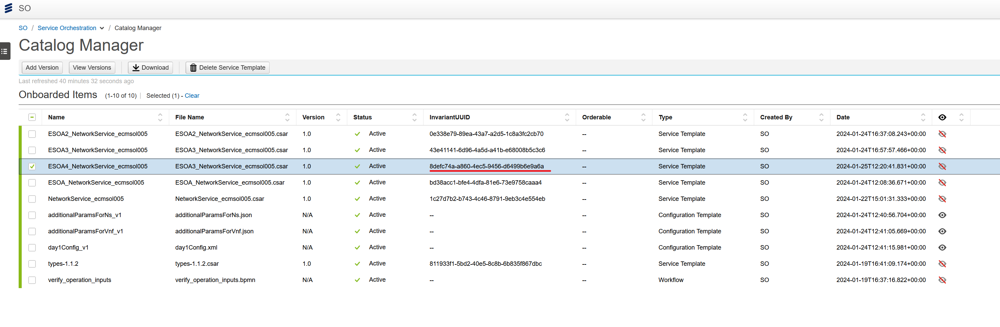
3. Create a json file with the following json format
   ````
   {
      "CREATE_RFSS": "true",
      "toscaInvariantUUID": "8defc74a-a860-4ec5-9456-d6499b6e9a6a",
      "toscaVersion": "1.0"
   }
   ````
4. Run the command to DNR to trigger it to reconcile and create an RFSS. Note the url is using the name of the feature pack we created "https://dr.supernova-haber003.ews.gic.ericsson.se/discovery-and-reconciliation/v1/feature-packs/test/listener/tosca_sid_listener/trigger"
   ````
   curl -k --insecure --socks5-hostname localhost:5005 POST --location 'https://dr.supernova-haber003.ews.gic.ericsson.se/discovery-and-reconciliation/v1/feature-packs/test/listener/tosca_sid_listener/trigger' \
   -H "Authorization: Bearer ${ACCESS_TOKEN}" \
   -H 'content-type: application/json' \
   --data-binary @/c/Users/egergle/rest/esoa/templates/dnr/listener.json
   ````
5. You will get the following reconciled
   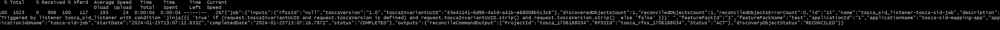

### Configure ECM

We are going to setup ECM to allow us to create a service order.

1. Go to ECM service designer and check it has your RFSS that you created. Follow this link as an example https://eric-ecm-services.supernova-haber003.ews.gic.ericsson.se/cd-ui/ Note: it can also be gotten from using the portal
2. Check that your RFSS was created. the project tosca_rfss_1706188034 should match the RFSSId in the cli request in the DNR section above. (Strangely it did not carry the name it was given but using the artifact that i have already done before for this example)
3. 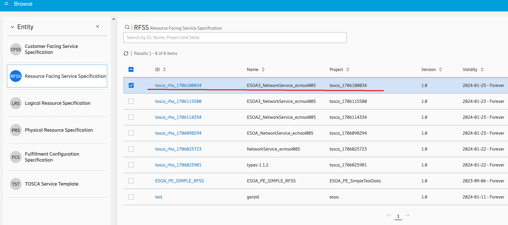    
4. Open ecm Catalog Designer by following either the portal or example url: https://eric-ecm-services.supernova-haber003.ews.gic.ericsson.se/ecm/ecm
5. Go To menu on left and select Projects under Project & Requests 
6. 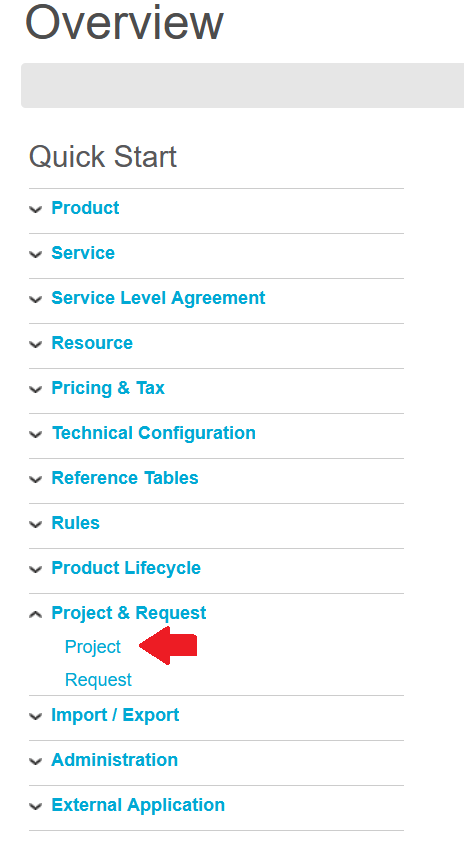
7. Select your project and then click "Project Utility". what we want to do here is take it out of active state so we can edit. It will allows then to created a CFSS and connected our RFSS that we created to it.
8. 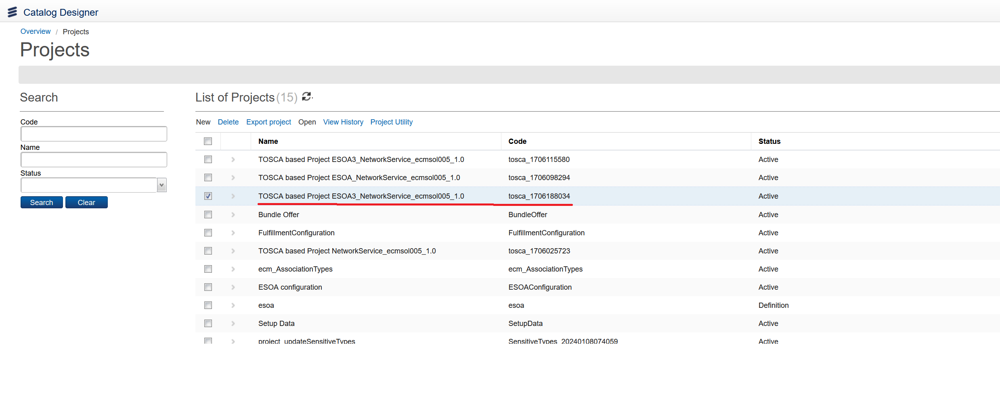
9. Click the checkbox "Change project status". The new project status field will then be set to "DEF"
10. 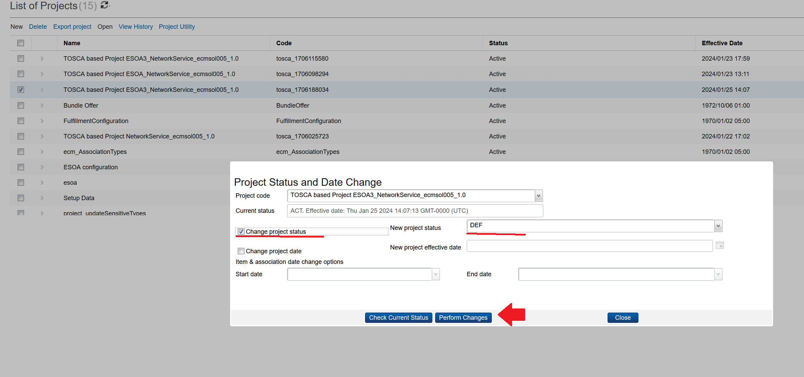  
11. Click "Perform Changes" and then click "Close" for the status to change
12. 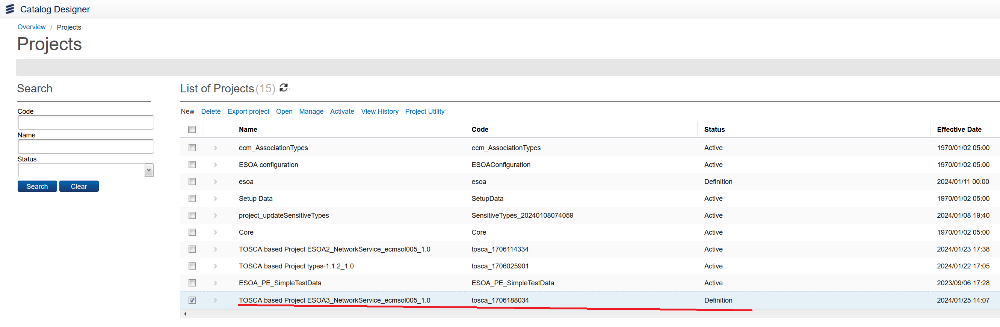    
13. Click on the checkbox of the project and click "Open" on the options over the table.
14. The top right of the page. The name of the project will be updated.
15. 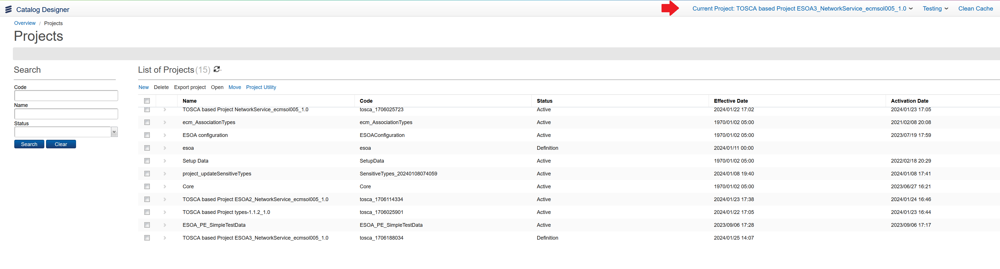    
16. Click on the breadcrumb Overview on the top left of the page to get back into the ECM main page
17. Click on the service drop down and then click "Customer Facing Service Specification" (CFSS)
18. 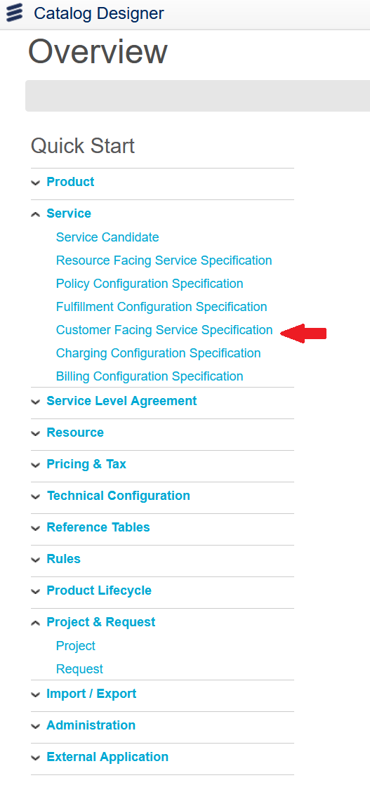
19. Click "New" from the options just over the table.
20. 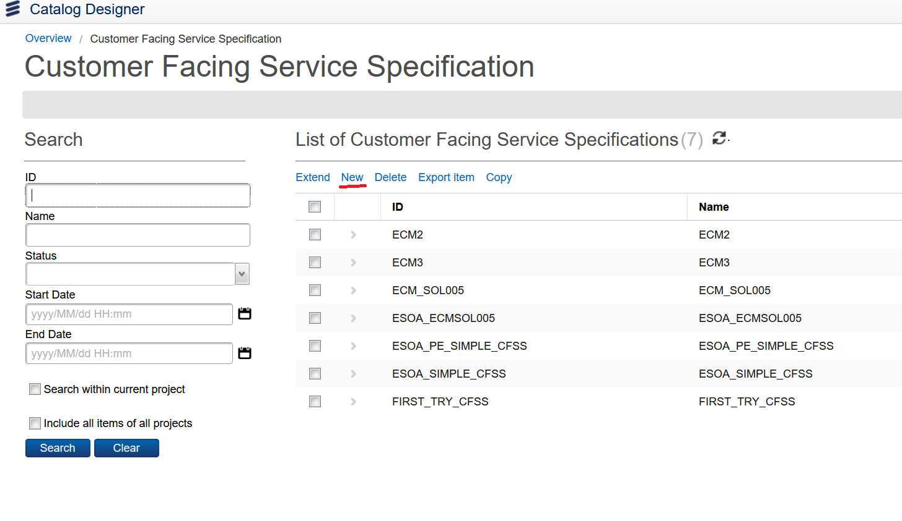
21. In the dialog that appears click "base_toscaCFSS" and click select.
22. 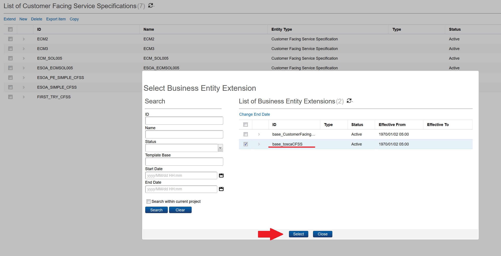
23. Update the ID and Name field to the same name. Set the Tosca Type field which is a drop down to Service Template.
24. 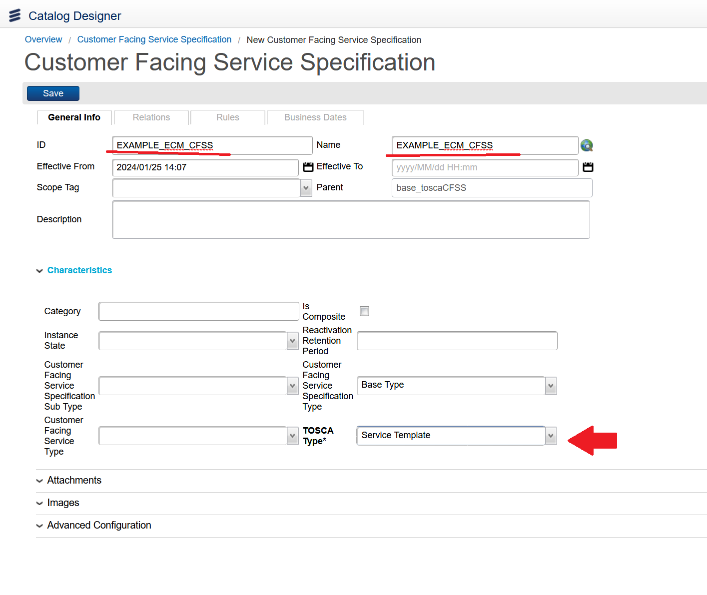
25. Click "Save".
26. Click the "Relations tab"
27. Click "New over the table"
28. 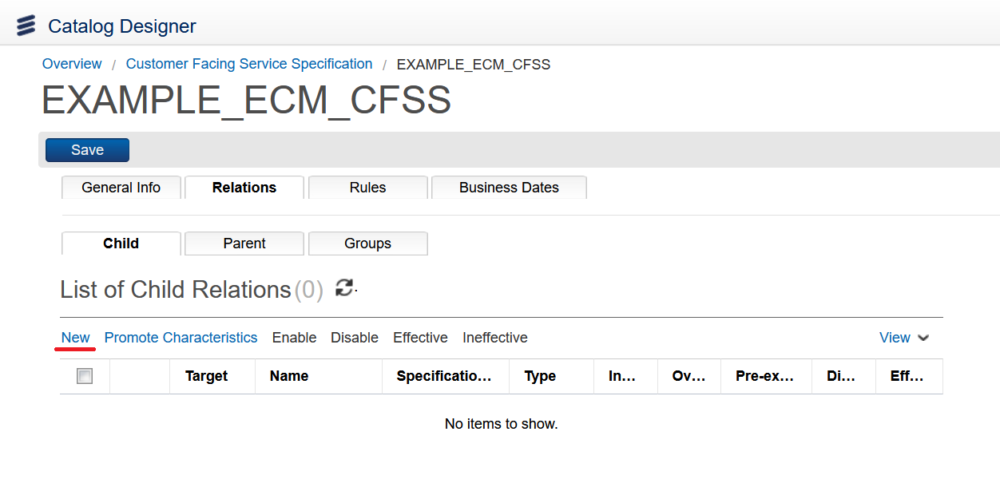
29. Type into the target field "tosca" and click the search icon.
30. Click your RFSS which will be in a definition state. Or use the name. i.e. tosca_rfss_1706188034
31. 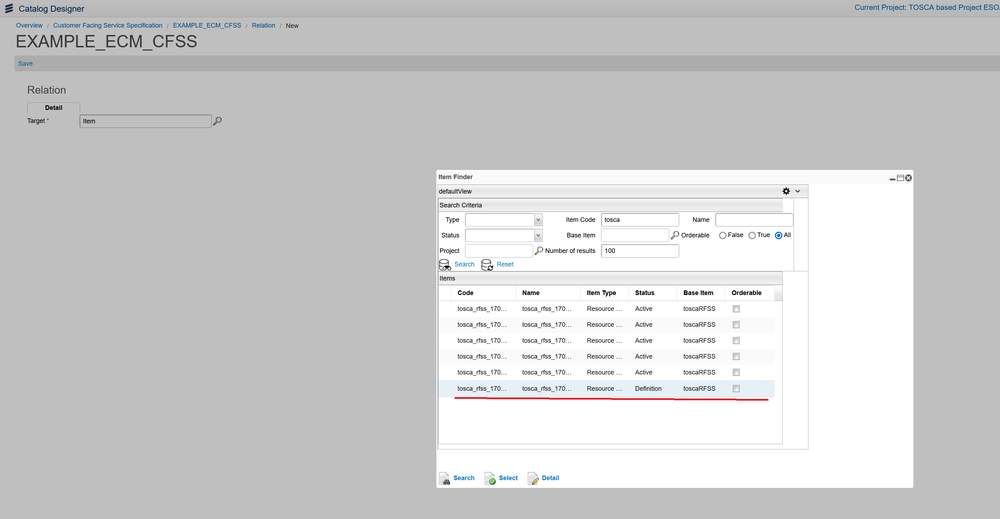
32. Click "Select"
33. Type into the type field "contains" and click "Save"
34. 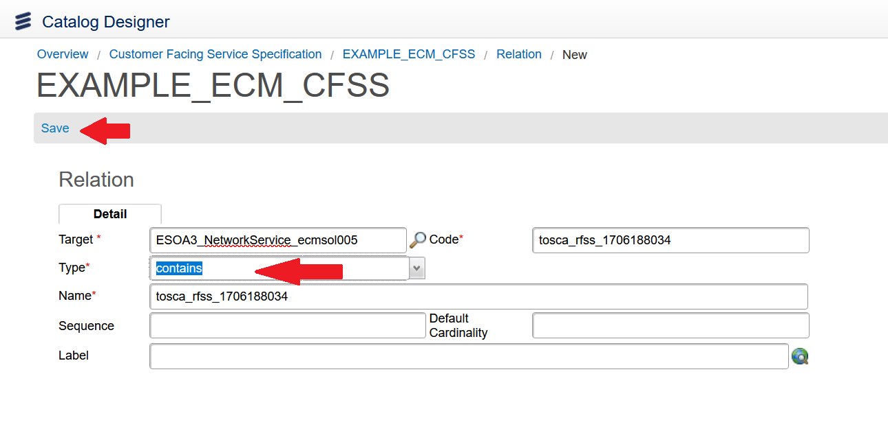
35. Click on the breadcrumb to move back to relation. Called "Relation" on top left.
36. Select the RFSS in the table and click "Promote Characteristics"
37. 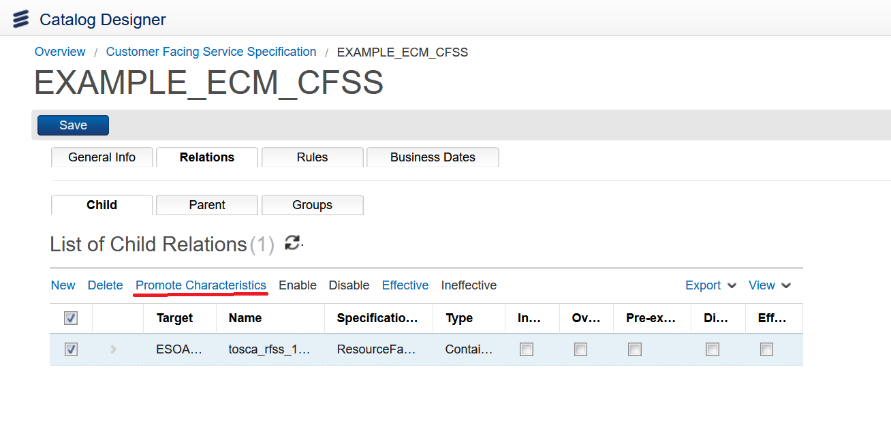
38. Set the drop down Promote From" to the name of the tosca rfss
39. Set classification types to "TOSCA Input"
40. Select all values that appear in the table.
41. Click "Promote" button at bottom
42. 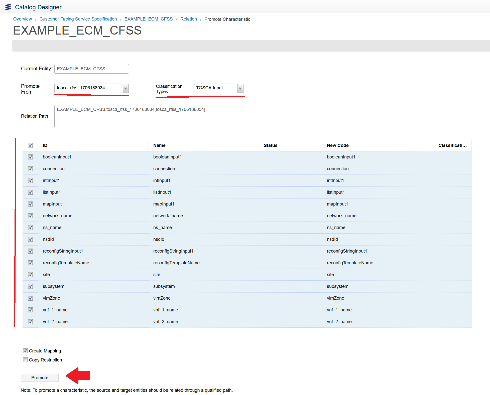
43. Click the breadcrumb to the CFSS name.
44. Click "Save"
45. 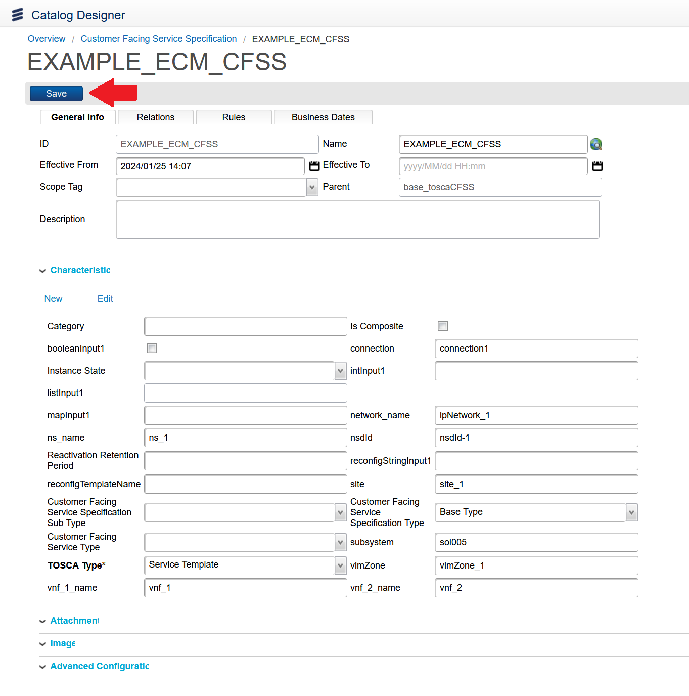
46. Click Overview breadcrumb to go back to main page
47. Click Project again under Project & Requests (We want to set the project back into active state)
48. Select the project that was previous set to definition.
49. Click "Project Utility" 
50. In the dialog Click checkbox to change project date. 
51. Set the date to a day behind the current date.
52. Click "Perform Changes" button (This button for some reason may not appear. If you click on another tab in the browser and then back it should then appear. )
53. 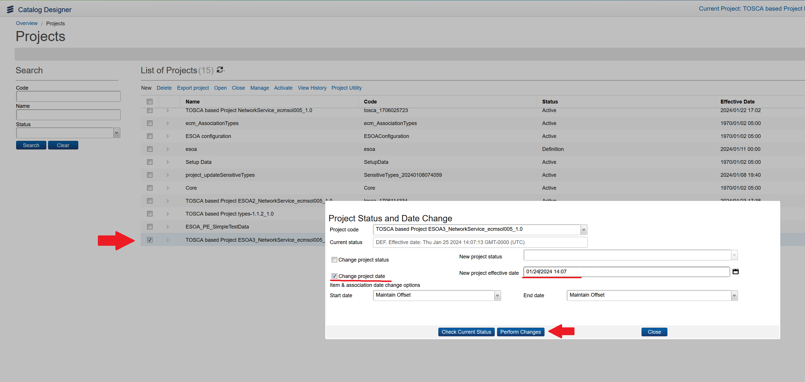
54. Click the checkbox "Change Project status". It will set to ACT (Active)
55. Click "Perform Changes".
56. Click "Close" 
57. 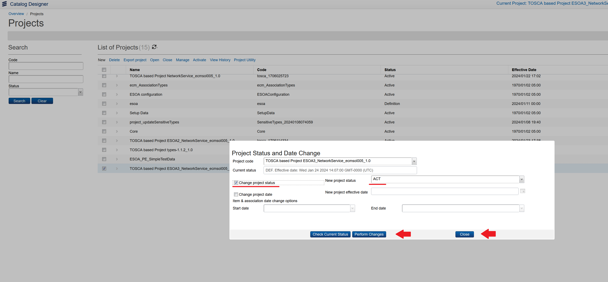
58. The project is now in an active state ready to be used.


### Create the Service Order

This step allows us to create the service order so it can trigger the workflows.

1. Create a file with the TMF 641 body to send to ECM.
    1. The requestId field needs to be a unique number that a user can change for each request.
    2. In serviceOrderItem.service.serviceSpecification.id, this is the name of the CFSS that we created i.e. EXAMPLE_ECM_CFSS
       ````
       {
            "description": "ECM SOL005 adapter Test",
            "run": "true",
            "createdBy": "ESOA_Automation",
            "isBundled": "false",
            "isLocked": "false",
            "mode": "NON_INTERACTIVE",
            "requestID": "100",
            "modifiedBy": "ESOA_Automation",
            "orderType": "ServiceOrder",
            "requester": "ESOA_Automation",
            "relatedParty": [
                {
                    "id": "440",
                    "role": "Customer"
                }
            ],
            "serviceOrderItem": [
                {
                    "id": "0",
                    "action": "Add",
                    "orderType": "ServiceOrder",
                    "service": {
                        "serviceType": "CFSS",
                        "serviceSpecification": {
                            "id": "EXAMPLE_ECM_CFSS"
                        },
                        "serviceCharacteristic": [
                            {
                                "name": "nsdId",
                                "value":  "nsdId123"
                            },
                            {
                                "name": "connection",
                                "value":  "connection1"
                            },
                            {
                                "name": "subsystem",
                                "value": "ecm"
                            },
                            {
                                "name": "intInput1",
                                "value": 2
                            },
                            {
                                "name": "booleanInput1",
                                "value": true
                            },
                            {
                                "name": "listInput1",
                                "value": ["item1", "item2"]
                            },
                            {
                                "name": "mapInput1",
                                "value": {"key1": "value1"}
                            }
                        ]
                    },
                    "notes": [
                        {
                            "name": "Mary Silver",
                            "text": "Service sample note"
                        }
                    ]
                }
            ],
            "orderSpecification": {
                "name": "ServiceOrder",
                "characteristics": [
                    {
                        "name": "fpsId",
                        "value": "PC:OrderOrchestration"
                    },
                    {
                        "name": "duration",
                        "value": "100"
                    }
                ]
            }
       }
       ````

2. Run the command to create the service order as follows 
    ````  
    [Login]
    ACCESS_TOKEN=$(curl -k --socks5-hostname localhost:5005 --location https://eric-sec-access-mgmt.supernova-haber003.ews.gic.ericsson.se/auth/realms/master/protocol/openid-connect/token -H 'Content-Type: application/x-www-form-urlencoded' --data-urlencode 'client_id=authn-proxy' --data-urlencode 'username=so-user' --data-urlencode 'password=Ericsson123!' --data-urlencode 'client_secret=ir8hzyEM5tanYOVTnWhSHIfd6MizYMwSx' --data-urlencode 'grant_type=password' | jq -r '.access_token')
         
    [Create Service Order]
    curl -i --insecure --socks5-hostname localhost:5005 --request POST 'https://eric-eoc-services.supernova-haber003.ews.gic.ericsson.se/eoc/serviceOrdering/v4.0/serviceOrder/'  \
    -H "Authorization: Bearer ${ACCESS_TOKEN}" \
    -H 'Content-Type: application/json' \
    --data-binary @/c/Users/egergle/rest/esoa/ecm_sol005_service_order.json
    ````
3. This should now create the service order and trigger the workflows to begin.


### Other Service Order Examples

#### Domain Orchestrator Service Order
1. The requestId field needs to be a unique number that a user can change for each request.
2. The value in serviceOrderItem.service.serviceSpecification.id should match the name of the CFSS that was created in the previous steps.
````
{
    "description": "DO test",
    "run": "true",
    "createdBy": "ESOA_Automation",
    "isBundled": "false",
    "isLocked": "false",
    "mode": "NON_INTERACTIVE",
    "requestID": "1032",
    "modifiedBy": "ESOA_Automation",
    "orderType": "ServiceOrder",
    "requester": "ESOA_Automation",
    "relatedParty": [
        {
            "id": "440",
            "role": "Customer"
        }
    ],
    "serviceOrderItem": [
        {
            "id": "0",
            "action": "Add",
            "orderType": "ServiceOrder",
            "service": {
                "serviceType": "CFSS",
                "serviceSpecification": {
                    "id": "<CFSS_ID>"
                },
                "serviceCharacteristic": [

                ]
            },
            "notes": [
                {
                    "name": "Mary Silver",
                    "text": "Service sample note"
                }
            ]
        }
    ],
    "orderSpecification": {
        "name": "ServiceOrder",
        "characteristics": [
            {
                "name": "fpsId",
                "value": "PC:OrderOrchestration"
            },
            {
                "name": "duration",
                "value": "100"
            }
        ]
    }
}
`````

#### Playbook service order

`````
{
    "description": "Playbook Test",
    "run": "true",
    "createdBy": "ESOA_Automation",
    "isBundled": "false",
    "isLocked": "false",
    "mode": "NON_INTERACTIVE",
    "requestID": "106",
    "modifiedBy": "ESOA_Automation",
    "orderType": "ServiceOrder",
    "requester": "ESOA_Automation",
    "relatedParty": [
        {
            "id": "440",
            "role": "Customer"
        }
    ],
    "serviceOrderItem": [
        {
            "id": "0",
            "action": "Add",
            "orderType": "ServiceOrder",
            "service": {
                "serviceType": "CFSS",
                "serviceSpecification": {
                    "id": "PLAYBOOK_CFSS"
                },
                "serviceCharacteristic": [
                    {
                        "name": "node_name",
                        "value":  "node_playbook_service"
                    },
					{
                        "name": "subsystem_name",
                        "value":  "enm"
                    },
					{
                        "name": "connection_name",
                        "value":  "enm"
                    },
					{
                        "name": "entry_playbook",
                        "value":  "sample_playbook.yml"
                    }
				]
            },
            "notes": [
                {
                    "name": "Mary Silver",
                    "text": "Service sample note"
                }
            ]
        }
    ],
    "orderSpecification": {
        "name": "ServiceOrder",
        "characteristics": [
            {
                "name": "fpsId",
                "value": "PC:OrderOrchestration"
            },
            {
                "name": "duration",
                "value": "100"
            }
        ]
    }
}
`````
### Modifying a Service Order

Once the service order is created and completed:
1. Retrieve the service ID value for the modify request body. This can be retrieved from the create service order response body. To view the response body:
   1. Retrieve the service order ID from either the response body of the create service order request or from the cockpit view. 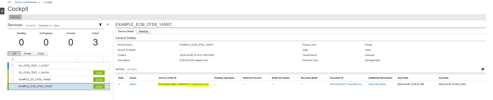
   2. Use the following url to view the response body by replacing the <serivce_order_id> value with the ID from the cockpit: https://eric-eoc-services.supernova-haber003.ews.gic.ericsson.se/eoc/serviceOrdering/v4.0/serviceOrder/<service_order_id>
   3. Find the service order item that has both the action 'add' and is a serviceType 'CustomerFacingServiceSpec'. The service ID value for the modify request is the service.id belonging to this service order item 
2. Create a file with the TMF 641 body to send to trigger the modify request.
   1. The requestId field needs to be a unique number that a user can change for each request.
   2. The value in relatedParty.id should match the customer ID that was previously used to create the service order.
   3. The value in serviceOrderItem.service.id (<SERVICE_ID>) should be the service ID retrieved in step 1 of this section.
   4. The value in serviceOrderItem.service.serviceSpecification.id (<CFSS_ID>) should match the name of the CFSS that was created in the previous steps

#### ECM Modify Service Order

   ````
   {
       "description": "ECM SOL005 adapter modify Test-workflow",
       "run": "true",
       "createdBy": "ESOA_Automation",
       "isBundled": "false",
       "isLocked": "false",
       "mode": "NON_INTERACTIVE",
       "requestID": "402",
       "modifiedBy": "ESOA_Automation",
       "orderType": "ServiceOrder",
       "requester": "ESOA_Automation",
       "relatedParty": [
           {
               "id": "440",
               "role": "Customer"
           }
       ],
       "serviceOrderItem": [
           {
               "id": "0",
               "action": "Modify",
               "orderType": "ServiceOrder",
               "service": {
                   "id": "<SERVICE_ID>",
                   "serviceType": "CFSS",
                   "serviceSpecification": {
                       "id": "<CFSS_ID>"
                   },
                   "serviceCharacteristic": [
                       {
                           "name": "reconfigTemplateName",
                           "value": "reconfig_v1"
                       },
                       {
                           "name": "reconfigStringInput1",
                           "value": "value1"
                       }
                   ]
               },
               "notes": [
                   {
                       "name": "Mary Silver",
                       "text": "Service sample note"
                   }
               ]
           }
       ],
       "orderSpecification": {
           "name": "ServiceOrder",
           "characteristics": [
               {
                   "name": "fpsId",
                   "value": "PC:OrderOrchestration"
               },
               {
                   "name": "duration",
                   "value": "100"
               }
           ]
       }
   }
   ````
#### Domain Orchestrator Modify Service Order

   ````
   {
       "description": "DO modify test-workflow",
       "run": "true",
       "createdBy": "ESOA_Automation",
       "isBundled": "false",
       "isLocked": "false",
       "mode": "NON_INTERACTIVE",
       "requestID": "702",
       "modifiedBy": "ESOA_Automation",
       "orderType": "ServiceOrder",
       "requester": "ESOA_Automation",
       "relatedParty": [
           {
               "id": "440",
               "role": "Customer"
           }
       ],
       "serviceOrderItem": [
           {
               "id": "0",
               "action": "Modify",
               "orderType": "ServiceOrder",
               "service": {
                   "id": "<SERVICE_ID>",
                   "serviceType": "CFSS",
                   "serviceSpecification": {
                       "id": "<CFSS_ID>"
                   },
                   "serviceCharacteristic": [
                       {
                           "name": "coreFunction",
                           "value": "coreFunctionNewValue"
                       }
                   ]
               },
               "notes": [
                   {
                       "name": "Mary Silver",
                       "text": "Service sample note"
                   }
               ]
           }
       ],
       "orderSpecification": {
           "name": "ServiceOrder",
           "characteristics": [
               {
                   "name": "fpsId",
                   "value": "PC:OrderOrchestration"
               },
               {
                   "name": "duration",
                   "value": "100"
               }
           ]
       }
   }
   ````

3. Use a curl command to send the modify request. Please see example:
   ````
   [Login]
   ACCESS_TOKEN=$(curl -k --socks5-hostname localhost:5005 --location https://eric-sec-access-mgmt.supernova-haber003.ews.gic.ericsson.se/auth/realms/master/protocol/openid-connect/token -H 'Content-Type: application/x-www-form-urlencoded' --data-urlencode 'client_id=authn-proxy' --data-urlencode 'username=so-user' --data-urlencode 'password=Ericsson123!' --data-urlencode 'client_secret=ir8hzyEM5tanYOVTnWhSHIfd6MizYMwSx' --data-urlencode 'grant_type=password' | jq -r '.access_token')

   [Modify ECM Order]
   curl -i --insecure --socks5-hostname localhost:5005 --request POST 'https://eric-eoc-services.supernova-haber003.ews.gic.ericsson.se/eoc/serviceOrdering/v4.0/serviceOrder/' \
   -H "Authorization: Bearer ${ACCESS_TOKEN}" \
   -H 'Content-Type: application/json' \
   --data-binary @<filepath>/modify_order.json
   ````
4. The modified service can be verified from the cockpit by:
   1. Checking the "Action", it should be set to modify. 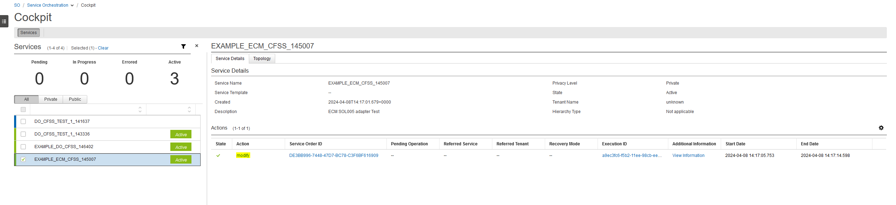
   2. Checking the "Additional Information" of the service. The new values should be listed in there. 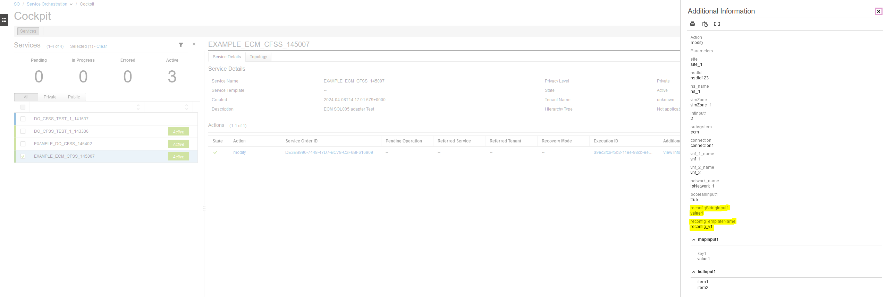

### Delete the Service Order

This step allows us to delete an existing service order so it can trigger the undeploy workflow. The service state must be in 'completed' state for undeploy operation to be performed.

1. Retrieve the service id value for the delete request body. This can be retrieved from the create service order response body. To view the response body:
   1. Retrieve the service order id from either the response body of the create service order request or from the cockpit view. 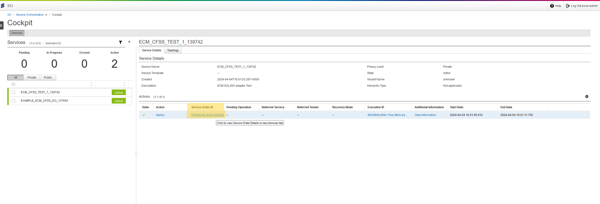
   2. Use the following url to view the response body by replacing the <serivce order id> value with the id from the cockpit: https://eric-eoc-services.imps3-haber003.ews.gic.ericsson.se/eoc/serviceOrdering/v4.0/serviceOrder/<service order id>
   3. Find the service order item that has both the action 'add' and is a serviceType 'CustomerFacingServiceSpec'. The service id value for the delete request is the service.id belonging to this service order item, i.e. 138037: 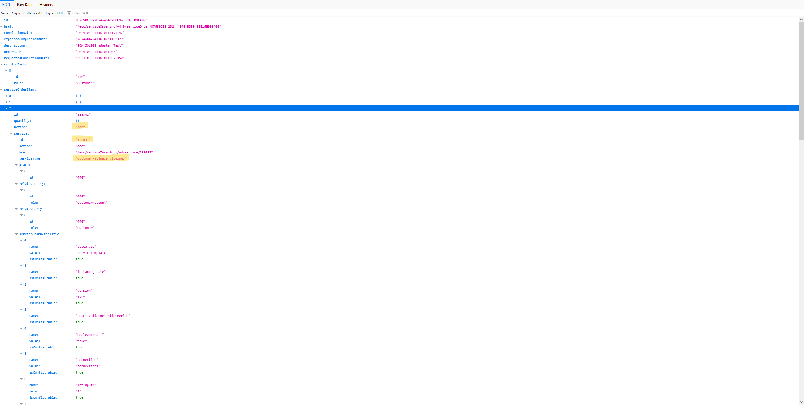
2. Create a file with the TMF 641 body to send to trigger the delete request.
   1. The requestId field needs to be a unique number that a user can change for each request.
   2. The value serviceOrderItem.service.id must match the service id value retrieved in step 1 of this section, i.e. 138037.
   3. The value serviceOrderItem.service.serviceSpecification.id must match the name of the CFSS previously used in the create request, i.e. ECM_CFSS_TEST_1.
````
{
    "description": "Sample test service order in SOM single service",
    "run": "true",
    "createdBy": "ESOA_Automation",
    "isBundled": "false",
    "isLocked": "false",
    "mode": "NON_INTERACTIVE",
    "requestID": "120",
    "modifiedBy": "ESOA_Automation",
    "orderType": "ServiceOrder",
    "requester": "ESOA_Automation",
    "relatedParty": [
        {
            "id": "440",
            "role": "Customer"
        }
    ],
    "serviceOrderItem": [
        {
            "id": "0",
            "action": "Delete",
            "orderType": "ServiceOrder",
            "service": {
                "serviceType": "CFSS",
                "id": "138037",
                "action": "Delete",
                "serviceSpecification": {
                    "id": "ECM_CFSS_TEST_1"
                }
            },
            "notes": [
                {
                    "name": "Mary Silver",
                    "text": "Service sample note"
                }
            ]
        }
    ],
    "orderSpecification": {
        "name": "ServiceOrder",
        "characteristics": [
            {
                "name": "fpsId",
                "value": "PC:OrderOrchestration"
            },
            {
                "name": "duration",
                "value": "100"
            }
        ]
    }
}
`````
3. Run the command to delete the service order as follows:
    ````
    [Login]
    ACCESS_TOKEN=$(curl -k --socks5-hostname localhost:5005 --location https://eric-sec-access-mgmt.supernova-haber003.ews.gic.ericsson.se/auth/realms/master/protocol/openid-connect/token -H 'Content-Type: application/x-www-form-urlencoded' --data-urlencode 'client_id=authn-proxy' --data-urlencode 'username=so-user' --data-urlencode 'password=Ericsson123!' --data-urlencode 'client_secret=ir8hzyEM5tanYOVTnWhSHIfd6MizYMwSx' --data-urlencode 'grant_type=password' | jq -r '.access_token')

    [Delete Service Order]
    curl -i --insecure --socks5-hostname localhost:5005 --request POST 'https://eric-eoc-services.supernova-haber003.ews.gic.ericsson.se/eoc/serviceOrdering/v4.0/serviceOrder/'  \
    -H "Authorization: Bearer ${ACCESS_TOKEN}" \
    -H 'Content-Type: application/json' \
    --data-binary @/c/Users/egergle/rest/esoa/ecm_sol005_delete_service_order.json
    ````
4. This should now delete the service order and trigger the undeploy workflow.
5. The deletion can be verified by:
   1. Checking the cockpit view and noting the service order previously created has been deleted 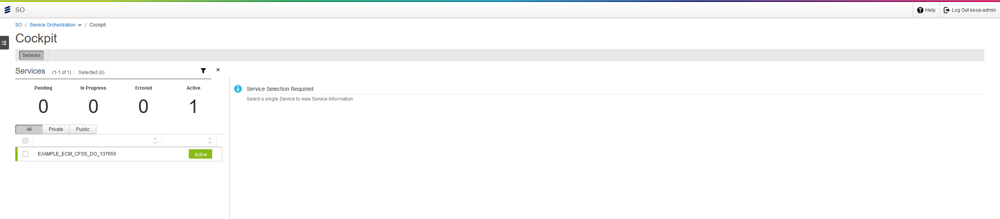
   2. Checking the response body of the delete request: https://eric-eoc-services.imps3-haber003.ews.gic.ericsson.se/eoc/serviceOrdering/v4.0/serviceOrder/<service order id> 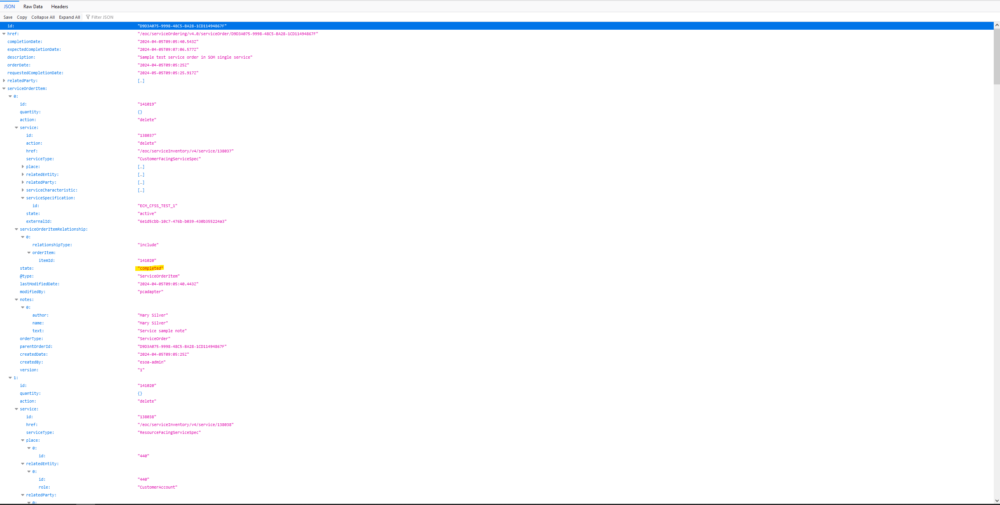