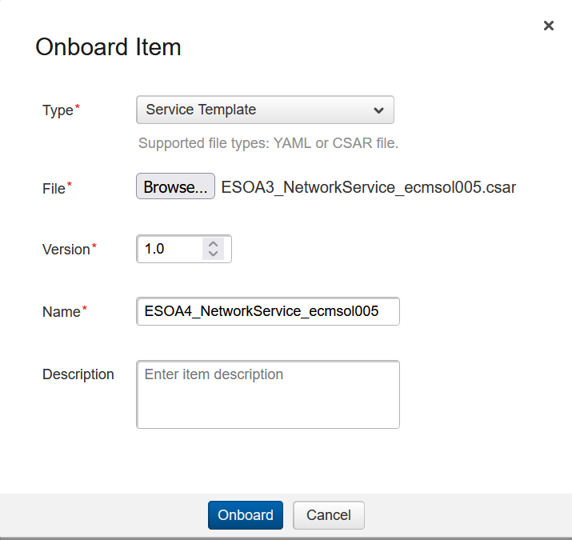
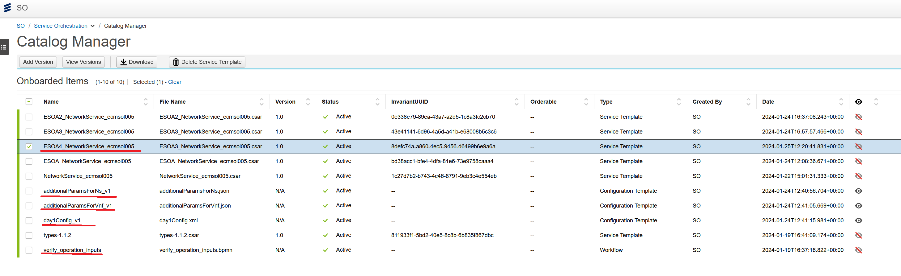

# Introduction

This page will show and provide an example what to onboard and setup in connected systems for ecmsol005-adapter artifacts.

## Steps
### Adding ecmsol005 artifacts

We are just adding the service templates and configuration templates to SO catalog manager.

1. Onboard SO csar and configuration templates to so-catalog manager
   1. 
   2. 
2. verify_operation_inputs bpmn file does not get upload to process-controller and so it needs to be added manually. Officially this would require a hook or addition on install to add the bpmn. But we will show a simpler way.
   1. Get the bear token by logging in via command line.
      * --socks5-hostname localhost:5005 used for ssh proxy. remove if not needed
      * ````
         ACCESS_TOKEN=$(curl -k --socks5-hostname localhost:5005 --location https://eric-sec-access-mgmt.supernova-haber003.ews.gic.ericsson.se/auth/realms/master/protocol/openid-connect/token -H 'Content-Type: application/x-www-form-urlencoded' --data-urlencode 'client_id=authn-proxy' --data-urlencode 'username=so-user' --data-urlencode 'password=Ericsson123!' --data-urlencode 'client_secret=ir8hzyEM5tanYOVTnWhSHIfd6MizYMwSx' --data-urlencode 'grant_type=password' | jq -r '.access_token')
         ````
      * ````
         echo $ACCESS_TOKEN
         ````
      * ````
         curl --socks5-hostname localhost:5005 --location 'https://eric-eoc-services.supernova-haber003.ews.gic.ericsson.se/process-controller/rest/deployment/create' \
         --header 'Authorization: Bearer ${ACCESS_TOKEN}' \
         --form 'data=@"/c/Users/egergle/rest/esoa/templates/ecmSol005_adapter/verify_operation_inputs.bpmn"' \
         --form 'deployment-name="verify_operation_inputs"'
         ````

3. All artifacts are now ready. Grab a coffee the next parts get far more complicated.

### Update Connected Systems

We want to add the subsystems we will need for ecmsol005-adapter

The username and password and client secret used in auth.body may be different depending on your environment.

1. Create Files for the subsystems needed. This will contain all the data needed for the request.

2. Create file for EO CM connection for our test 

    ````
    {
      "name": "ecm",
      "subsystemType": {
        "id": 2,
        "type": "NFVO",
        "alias": "NFVO"
      },
      "url": "http://eric-eo-ecmsol005-stub",
      "connectionProperties": [
        {
          "name": "connection1",
          "username": "ecmadmin",
          "password": "CloudAdmin123",
          "connection_name": "ecm",
          "tenant": "master",
          "encryptedKeys": [
            "password"
          ],
          "subsystemUsers": []
        }
      ],
      "vendor": "Ericsson",
      "adapterLink": "eric-eo-ecmsol005-adapter"
    }
    ````
5. Use curl command to create them into the system. Please see example 
   ````
   [Login]
   ACCESS_TOKEN=$(curl -k --socks5-hostname localhost:5005 --location https://eric-sec-access-mgmt.supernova-haber003.ews.gic.ericsson.se/auth/realms/master/protocol/openid-connect/token -H 'Content-Type: application/x-www-form-urlencoded' --data-urlencode 'client_id=authn-proxy' --data-urlencode 'username=so-user' --data-urlencode 'password=Ericsson123!' --data-urlencode 'client_secret=ir8hzyEM5tanYOVTnWhSHIfd6MizYMwSx' --data-urlencode 'grant_type=password' | jq -r '.access_token')
         
   [Create EO CM subsystem]
   curl -k --insecure --socks5-hostname localhost:5005 POST --location 'https://gas.supernova-haber003.ews.gic.ericsson.se/subsystem-manager/v2/subsystems' \
   -H "Authorization: Bearer ${ACCESS_TOKEN}" \
   -H 'content-type: application/json' \
   --data-binary @/c/Users/egergle/rest/esoa/templates/ecmSol005_adapter/ecm.json
   ````

